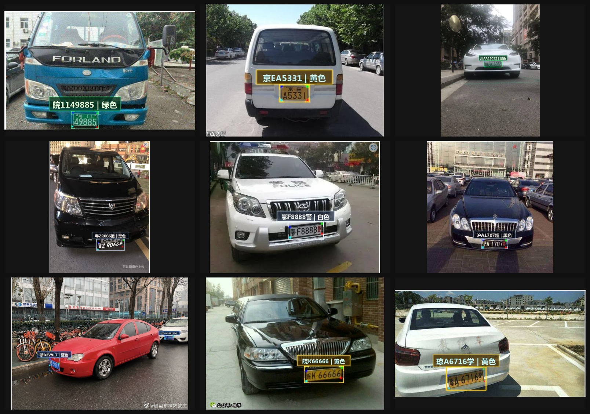

# 车牌检测+识别项目说明（YOLO26 Pose）

本项目基于 `Ultralytics YOLO26` 做了车牌场景改造，核心能力是：

- 车牌检测（`pose` 任务，输出框 + 4 个角点关键点）
- 车牌透视矫正
- 车牌字符识别 + 车牌颜色识别
- 结果可视化（科技风绘制）

当前主入口脚本是：`detect_rec_plate.py`。

## 展示效果



---

## 1. 环境搭建

建议：

- Python `>=3.11`（项目 `pyproject.toml` 要求）
- PyTorch（CPU 或 CUDA）
- OpenCV
- Ultralytics（本仓库源码已包含）

### 1.1 用 uv（推荐）

安装 `uv`（若未安装）：

```bash
curl -LsSf https://astral.sh/uv/install.sh | sh
```

在仓库根目录安装依赖：

```bash
uv sync
```

运行脚本：

```bash
uv run detect_rec_plate.py
```

### 1.2 用 pip

在仓库根目录安装：

```bash
pip install -e .
```

运行脚本：

```bash
python detect_rec_plate.py
```

---

## 2. 整体流程

`detect_rec_plate.py` 的执行链路如下：

1. 用 YOLO26 pose 模型检测车牌，得到：
   - `bbox`（车牌框）
   - `keypoints`（4 个角点）
   - `cls`（单层/双层）
2. 使用 4 个角点做透视变换，裁出矫正后的车牌 ROI。
3. 如果是双层车牌（`cls=1`），先做双层拼接处理再识别。
4. 调用车牌识别模型输出：
   - 车牌号（如 `川AA16052`）
   - 车牌颜色（如 `绿色`）
5. 在原图上绘制检测框、关键点和识别信息，保存结果图。

---

## 3. 关键文件

- `detect_rec_plate.py`：检测+识别主脚本（推荐从这里跑全流程）
- `train.py`：检测模型训练脚本（YOLO26 pose）
- `plate_cfg/plate.yaml`：检测训练数据配置
- `plate_recognition/plate_rec.py`：车牌识别推理逻辑
- `plate_recognition/plateNet.py`：车牌识别网络定义
- `weights/yolo26s-plate-detect.pt`：检测模型权重（示例）
- `weights/plate_rec_color.pth`：识别模型权重（示例）

---

## 4. 一键跑检测+识别

### 4.1 默认命令（CPU）

```bash
python detect_rec_plate.py \
  --detect_model weights/yolo26s-plate-detect.pt \
  --rec_model weights/plate_rec_color.pth \
  --image_path imgs \
  --output result_slim_tech \
  --device cpu
```

### 4.2 参数说明

- `--detect_model`：检测模型 `.pt` 路径（YOLO26 pose）
- `--rec_model`：识别模型 `.pth` 路径
- `--image_path`：输入图片目录（会递归遍历）
- `--output`：结果输出目录
- `--device`：`cpu` 或 `cuda:0`

---

## 5. 检测模型训练（Pose）

本项目检测用的是 **pose 训练**，不是普通 detect。  
原因：需要同时回归车牌四角关键点，供后续透视矫正与识别。

### 5.1 数据配置文件

文件：`plate_cfg/plate.yaml`

核心字段：

- `train` / `val`：训练与验证图片路径
- `kpt_shape: [4, 2]`：每个目标 4 个关键点，每个关键点只有 `x,y`
- `flip_idx: [1, 0, 3, 2]`：关键点翻转映射
- `names`：类别定义
  - `0: single`（单层车牌）
  - `1: double`（双层车牌）

> 注意：你需要把 `train` / `val` 改成自己机器上的真实路径。

### 5.2 数据集目录结构（YOLO Pose 标准）

建议结构：

```text
dataset_root/
  images/
    train/
      xxx.jpg
    val/
      yyy.jpg
  labels/
    train/
      xxx.txt
    val/
      yyy.txt
```

### 5.3 标注格式（重点）

每个目标一行，格式为：

```text
class cx cy w h kpt1_x kpt1_y kpt2_x kpt2_y kpt3_x kpt3_y kpt4_x kpt4_y
```

全部坐标均为**归一化到 0~1**。

- `class`：类别 id（0 单层，1 双层）
- `cx cy w h`：目标框（归一化）
- `kpt*_x kpt*_y`：4 个关键点坐标（归一化）

示例（仅演示格式）：

```text
0 0.512 0.448 0.216 0.082 0.406 0.414 0.618 0.410 0.620 0.487 0.404 0.492
```

### 5.4 关键点顺序建议

建议固定顺序：

1. 左上
2. 右上
3. 右下
4. 左下

训练、标注、推理三者必须保持一致，否则透视矫正会错位。

### 5.5 启动训练

方式 1：直接用项目脚本

```bash
python train.py
```

`train.py` 当前默认：

- 模型：`weights/yolo26s-pose.pt`
- 数据：`plate_cfg/plate.yaml`
- `epochs=120`
- `imgsz=640`
- `batch=16`

方式 2：用 Ultralytics CLI（等价）

```bash
yolo pose train \
  model=weights/yolo26s-pose.pt \
  data=plate_cfg/plate.yaml \
  epochs=120 \
  imgsz=640 \
  batch=16 \
  device=0
```

### 5.6 车牌字符识别训练

车牌识别训练链接如下：

[车牌识别训练](https://github.com/we0091234/crnn_plate_recognition)

---

## 6. ONNX 相关（可选）

如果你走 ONNX 检测部署，可参考：

- `export_onnx.py`：导出脚本
- `onnx_detect.py`：ONNX 检测推理脚本

对于 `nms=True` 导出的 pose ONNX，常见输出是 `1x300x14`，字段一般按：

```text
[x1, y1, x2, y2, conf, cls, kpt1x, kpt1y, kpt2x, kpt2y, kpt3x, kpt3y, kpt4x, kpt4y]
```

该输出已做过 NMS，后处理通常只需做阈值过滤和坐标映射。

## 7. 建议工作流

1. 先用 `detect_rec_plate.py` 跑通端到端。
2. 确保检测框和 4 点关键点稳定。
3. 再针对识别模型做精调（尤其双层车牌、夜间、反光样本）。
4. 最后再做 ONNX 部署和速度优化。
